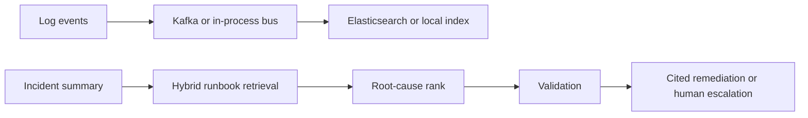

# Agentic Incident Response

[](https://github.com/AsrithaReddy-123/agentic-incident-response/actions/workflows/ci.yml)

Agents retrieve a runbook, rank root causes, and either cite a remediation step that appears in that runbook or escalate.

## Measured results

100,000 synthetic log events. 5,200 runbook chunks. 80 labeled incidents. Embedder `sentence-transformers/all-MiniLM-L6-v2`.

| Metric | Result |
| --- | ---: |
| In-process ingestion | 410,097 events/sec |
| Recall@5 | 1.00 |
| Top-3 root-cause accuracy | 1.00 |
| Unsupported remediation, unvalidated | 1.00 |
| Unsupported remediation, validated | 0.00 |

The ingestion rate is the in-process bus, not a Kafka cluster. CI starts Kafka and Elasticsearch and runs `tests/test_services.py` against them. The published quality numbers are in [`evaluation/results/benchmark.json`](evaluation/results/benchmark.json).

## Architecture



## Run

```bash
uv sync --extra dev
uv run uvicorn app.main:app --reload
uv run python -m evaluation.run_eval
```

`POST /investigate` takes `{"summary": "..."}` and returns ranked causes, a remediation or escalation, confidence, and citations.

`docker-compose.yml` can start Kafka, Elasticsearch, and the API. The published benchmark does not require those services; it records the local bus throughput and hybrid retrieval quality in `evaluation/results/benchmark.json`.

LLM-only behavior in the comparison is the unvalidated agent, which appends a remediation step that is not in the runbook. The validated agent refuses that step.
