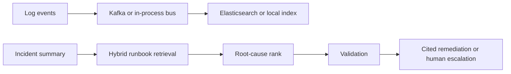

# Agentic Incident Response

Agents retrieve a runbook, rank root causes, and either cite a remediation step that appears in that runbook or escalate. The benchmark drives 100,000 synthetic log events through an in-process bus and a local index. Kafka and Elasticsearch clients are included for when `KAFKA_BOOTSTRAP` or `ELASTICSEARCH_URL` is set.

## Architecture



## Run

```bash
uv sync --extra dev
uv run uvicorn app.main:app --reload
uv run python -m evaluation.run_eval
```

`POST /investigate` takes `{"summary": "..."}` and returns ranked causes, a remediation or escalation, confidence, and citations.

`docker-compose.yml` can start Kafka, Elasticsearch, and the API. The published benchmark does not require those services; it records the local bus throughput and hybrid retrieval quality in `evaluation/results/benchmark.json`.

LLM-only behavior in the comparison is the unvalidated agent, which appends a remediation step that is not in the runbook. The validated agent refuses that step.
